# Lung-Cancer-Detection 

## Introduction
The World Health Organization (WHO) has stated that Cancer is the leading cause of death worldwide. It accounted for nearly 10 million deaths in 2020 alone. Of all the different possible types of Cancer, Lung Cancer was the most common cause of cancer death in 2020, accounting for about 1.80 million deaths.

Lung cancer occurs when cells of the lungs start dividing uncontrollably without dying off. This causes the growth of tumors which can reduce a person’s ability to breathe and spread to other parts of the body.

In our project, we classify lung CT scans to identify whether the cases are Benign, Malignant, or Normal. We do this using a Convolutional Neural Network. 

## Project Implementation 

### SDLC approach: Waterfall Model 
The Waterfall Model is a sequential design process, often used in Software development processes; where progress is seen flowing steadily through the phases of Conception, Initiation, Analysis, Design, Construction, Testing, Production/Implementation, and Maintenance. 

In the waterfall model, we start with the feasibility study and move down through the various phases of Implementation, Testing, Deployment, maintenance, and into the live environment. This Model is also called the classic Life-Cycle model as it suggests a systematic sequential approach to software development. This is one of the oldest models followed in software
engineering. The process begins with the communication phase where the customer specifies the requirements and then progresses through other phases like planning, modeling, construction, and deployment of the software.

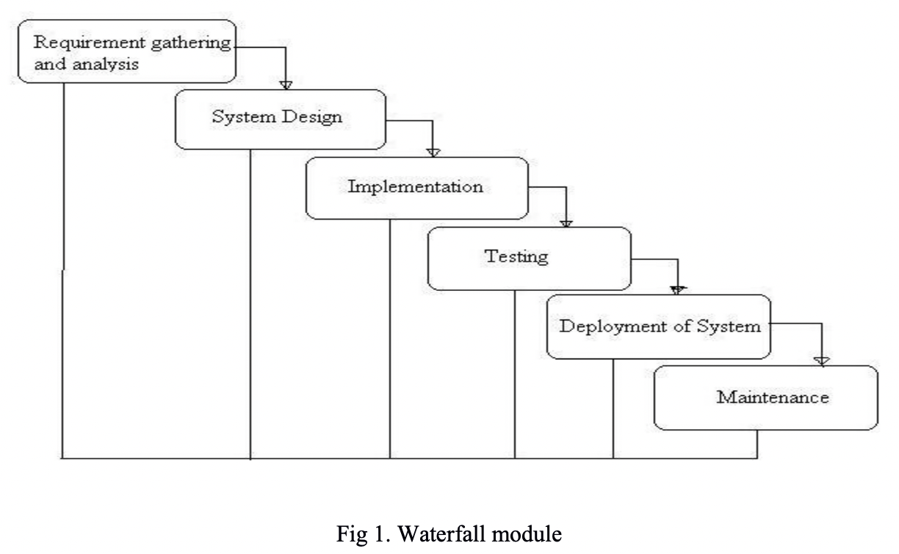

### System Architecture 

### Diagrams 

#### Data Flow Diagrams

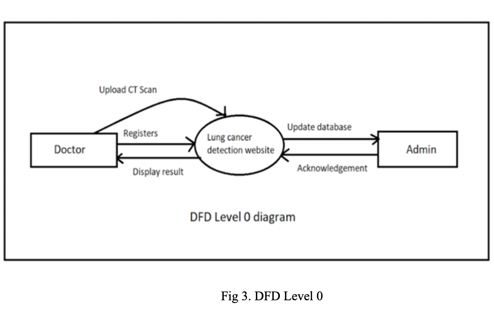

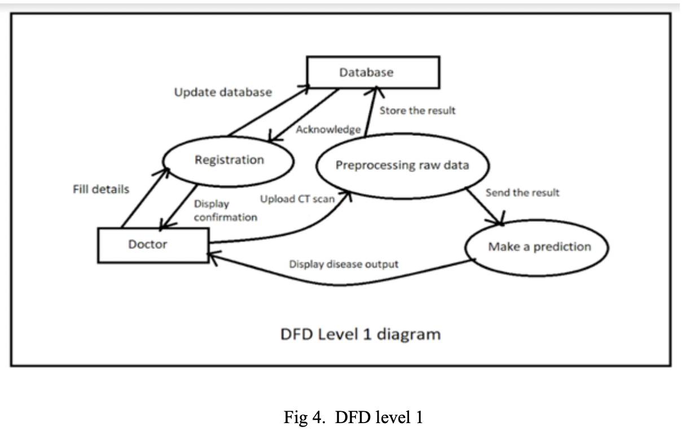

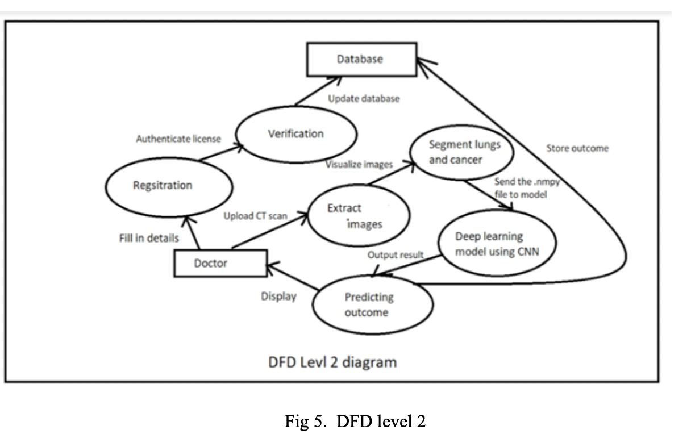

#### Entity Relationship Diagram

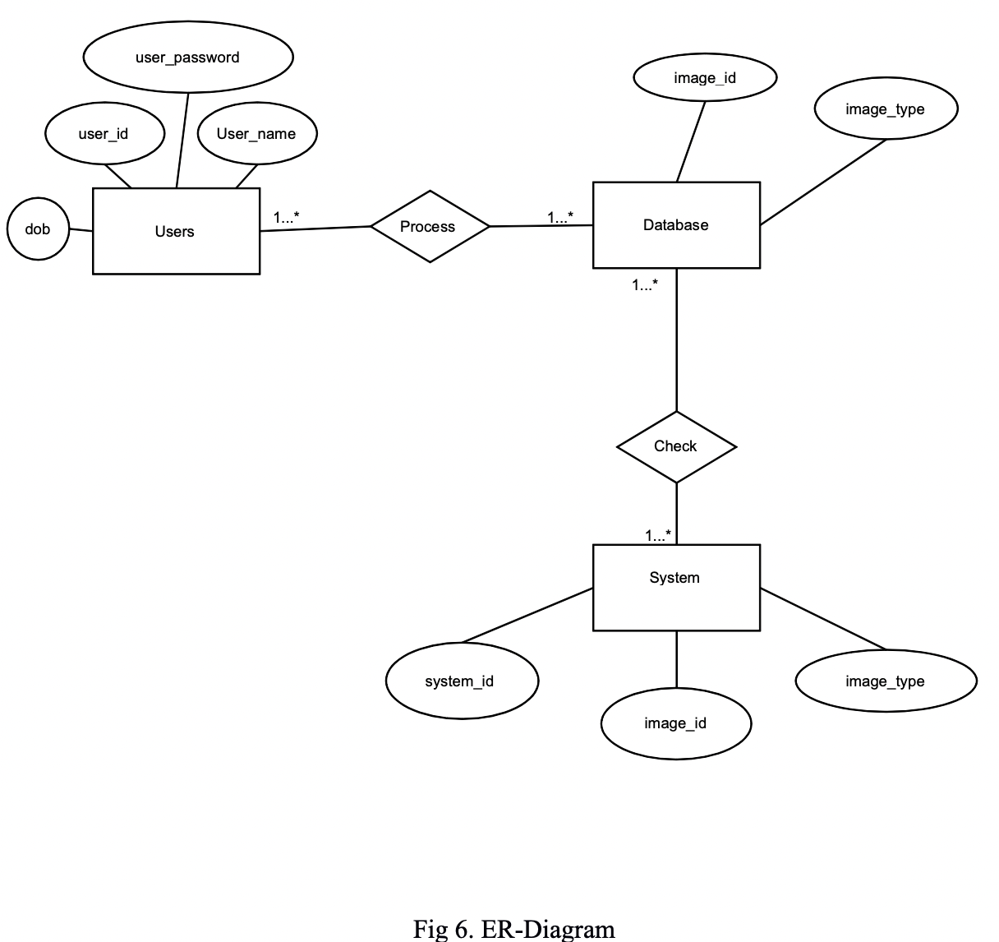

#### UML Diagrams

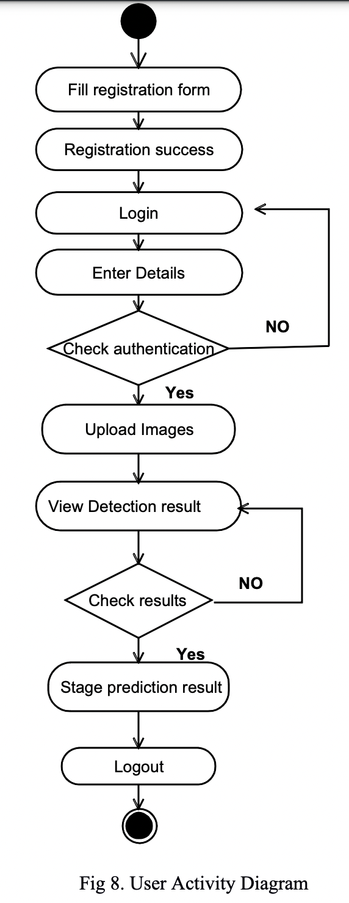

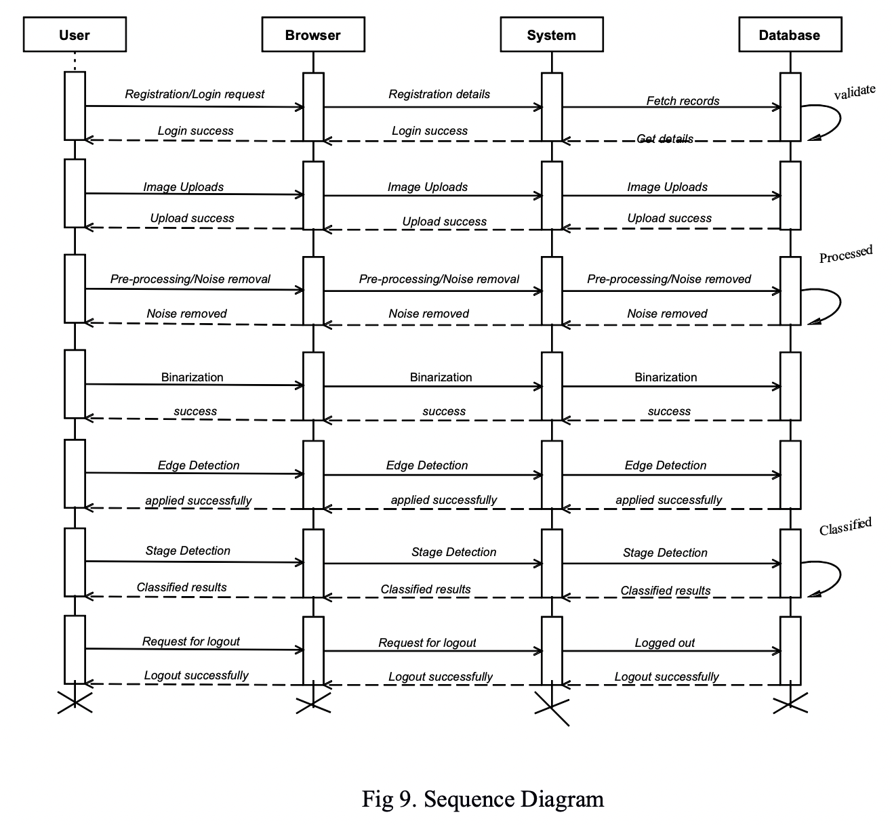

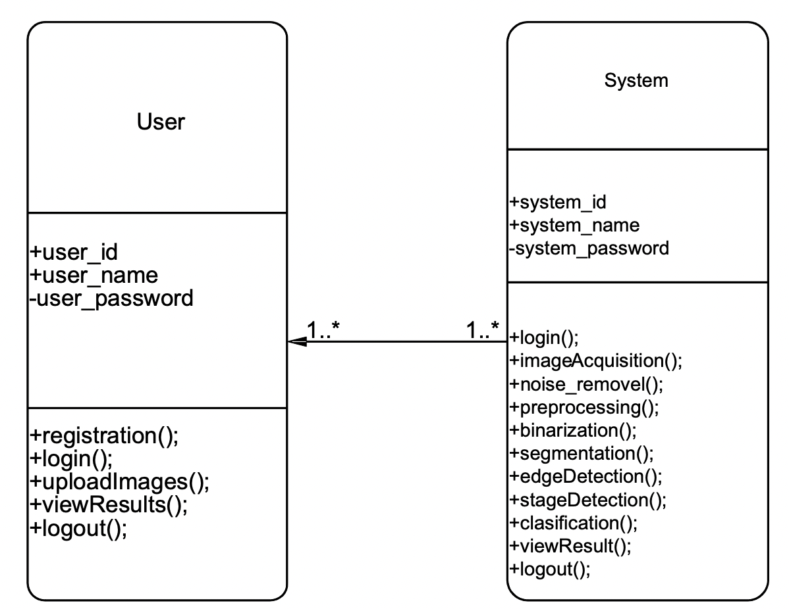

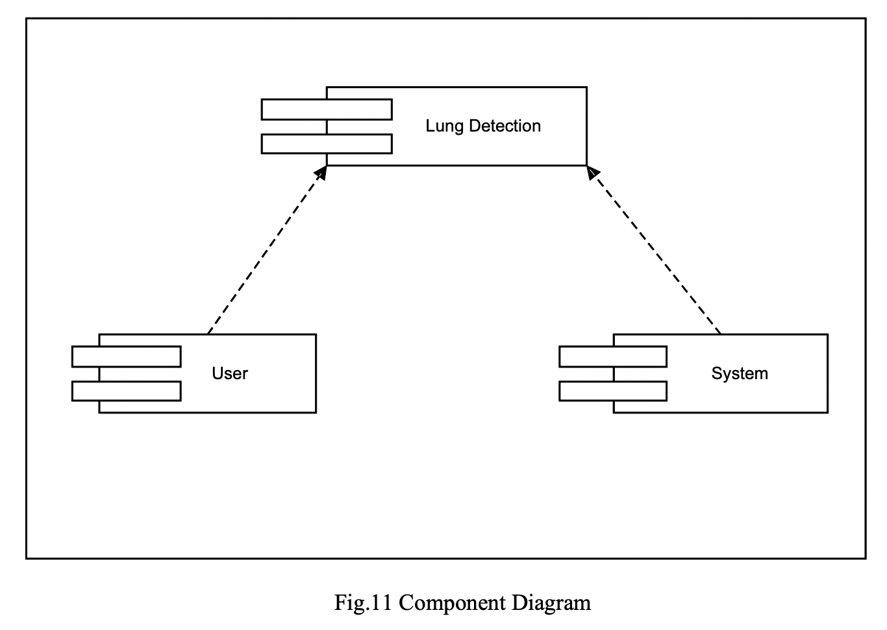

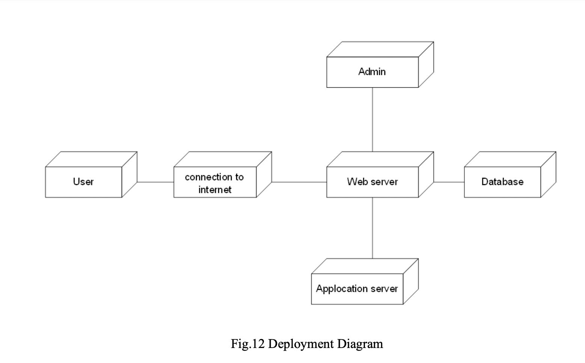

### Dataset Description

We have used the Lung Image Database Consortium and Image Database Resource Initiative (LIDC-IDRI) dataset, which is a collection of chest CT scans intended for research in lung cancer detection. It was created through collaboration between the Radiological Society of North America (RSNA) and the National Cancer Institute (NCI). The dataset was designed to facilitate the development and evaluation of computer-aided diagnostic (CAD) algorithms for lung cancer detection. The LIDC-IDRI dataset contains a total of 1,018 CT scans. 

### Model Development 

We have used the GoogleNet architecture in this project. Here is a little bit more information about why we used the GoogleNet architecture: 

GoogleNet, also known as Inception v1, is a deep convolutional neural network (CNN) architecture designed for image recognition and classification tasks. It was introduced by researchers from Google in a paper titled "Going Deeper with Convolutions" in 2014. GoogleNet uses inception modules, which allow the network to efficiently learn features at multiple spatial scales.

Key Features of GoogleNet Architecture:
1. Inception Modules:
Inception modules are the building blocks of GoogleNet. These modules use multiple convolutions with different filter sizes (1x1, 3x3, 5x5) and max-pooling operations simultaneously. The idea is to capture features at different scales, allowing the network to learn complex patterns efficiently.

2. 1x1 Convolutions:
GoogleNet extensively uses 1x1 convolutions, also known as network-in-network structures. These convolutions help in reducing the dimensionality and computational cost. They also enable the network to learn complex relationships between channels.

3. Global Average Pooling:
Instead of fully connected layers, GoogleNet uses global average pooling after the last convolutional layer. Global average pooling averages the values of each feature map, resulting in a fixed-length feature vector regardless of the input size. This reduces overfitting and the number of parameters in the network.

4. Auxiliary Classifiers:
GoogleNet includes auxiliary classifiers at intermediate layers. These classifiers help with the vanishing gradient problem during training. They introduce additional supervised signals, allowing the gradients to flow back earlier in the network, aiding in better training of the entire network.

We used the TensorFlow library to build our CNN model. Keras framework of the tensor flow library contains all the functionalities needed to define the architecture of a Convolutional Neural Network and train it on the data.

While compiling a model we provide these three essential parameters:

learning rate - the rate at which the model adjusts during training.
batch size - the number of data samples processed before updating the model.
optimizer – this is the method that helps to optimize the cost function by using gradient descent.
loss – the loss function by which we monitor whether the model is improving with training or not.
dropout rate - it is used to prevent overfitting, it represents the fraction or proportion of neurons in a specific layer that are randomly set to zero during training.
metrics – this helps to evaluate the model by predicting the training and the validation data.

### Model Evaluation

The performance of our CNN model is excellent as the f1-score for each class is above 0.90 which means our model’s prediction is correct 90% of the time. 

### Results

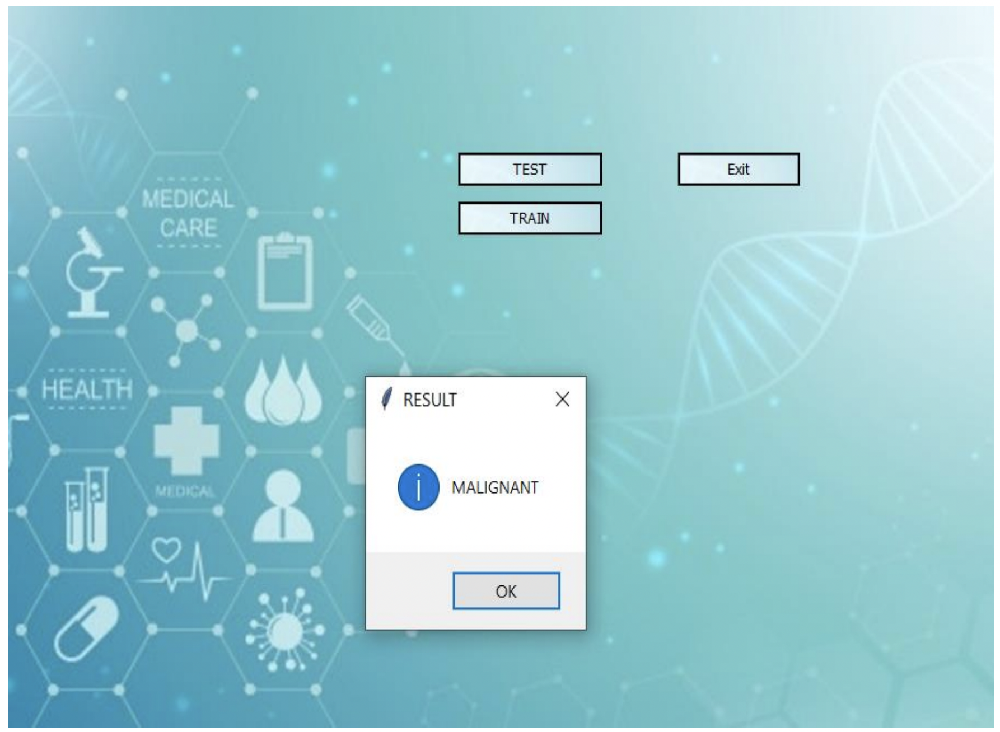

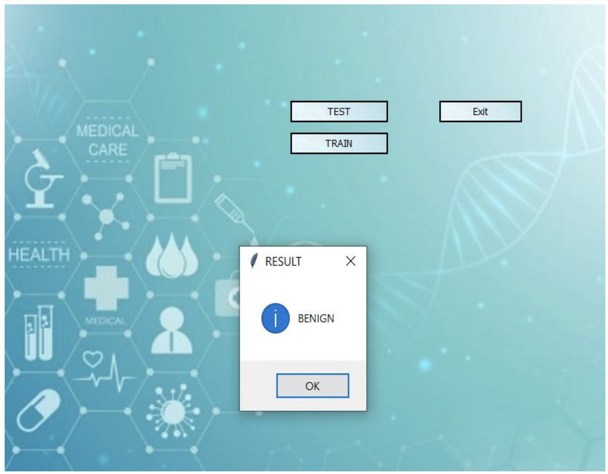
